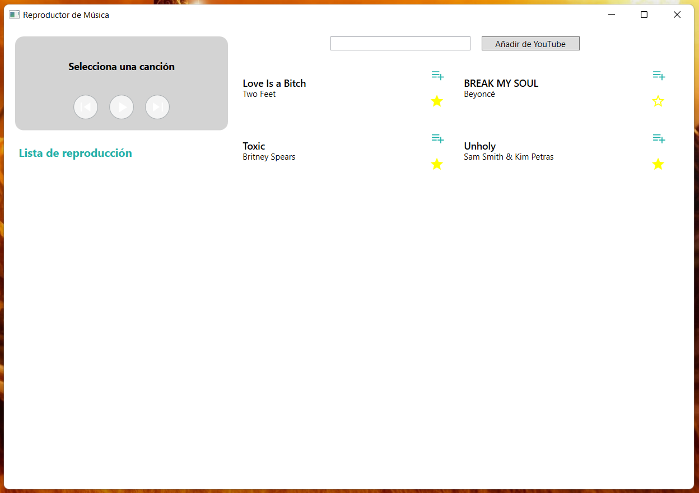
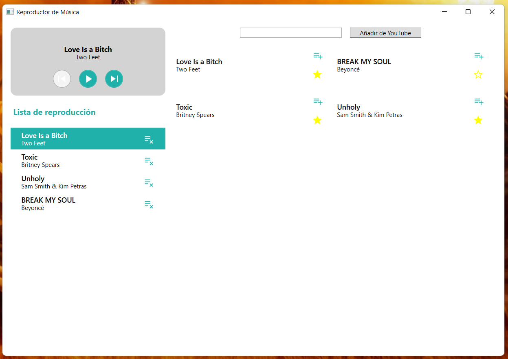
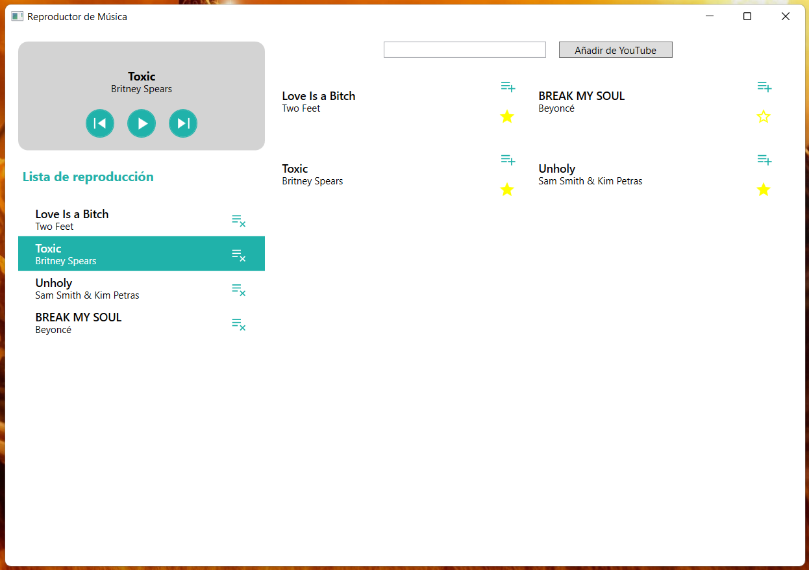

# Reproductor de Música

Este repositorio contiene el código del proyecto final desarrollado para la asignatura de Herramientas de Programación.

> Proyecto probado solamente en Windows.

## Problema o necesidad

Actualmente en el mercado de aplicaciones de escritorio no hay muchos reproductores de música que tengan la posibilidad de escuchar música de YouTube sin necesidad de descargarlas previamente usando un convertidor online.

## Objetivos

### Objetivo General

Reproducir música de YouTube sin necesidad de descargar la canción en formato .mp3 usando una página que podría instalarte un virus.

## Imágenes

  
Estado inicial

  

  
Lista de reproducción

  
  

## Funcionalidades

- Reproducir archivos .mp3 que estén en el dispositivo (Carpeta Música)
- Reproducir música de YouTube y YouTube Music (Solo singles)
- Lista de reproducción
- Favoritos

## Requerimientos

- NodeJS
- Visual Studio 2022
- .NET Core 6.0

## ¿Cómo ejecutar el programa?

1. Ir a la carpeta `YouTubeAPI` y ejecutar el programa usando `yarn start`.

2. **(Desarrollo)**

    1. Abrir el archivo `PTFinalProject.csproj` o `PTFinalProject.sln` con Visual Studio y presionar `F5`.

3. **(Producción)**

    1. Abrir la carpeta del proyecto con PowerShell o CMD, ejecutar el comando `dotnet publish`.

    2. **Windows** Abrir el archivo en la carpeta `./bin/Debug/net6.0-windows/publish/PTFinalProject.exe`.

## Créditos

- [Daniel Solarte (@dsolartec)](https://danielsolarte.co)
